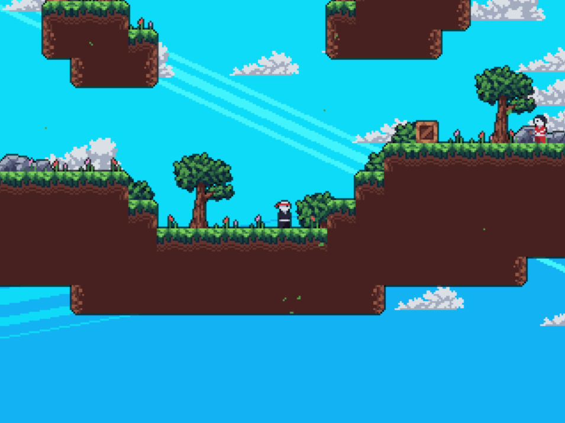

# Ninjacik: A Ninja Game

## Game Overview

This is a basic pygame platformer game. The arrow keys control the player and the 'x' button activates dash. Dash through enemies to kill them while avoiding their gun shots. Eleminate all enemies to win the level and move on to the next one.

### Refer to the video in /Extras to view a sample gameplay

## Level Editor Overview

The level editor is used to generate maps easily. It stores the generated maps in test directory in maps under data. Use WASD keys to move the camera around the map. Use the scroll wheel to go through the different tile types, and use the scroll wheel while holding down shift to go through the tile type variants. By default, tiles are placed on grid; to trigger off-grid tile placement press the G key. To place a desired tile, simply left click at the desired location. To remove a tile, simply right click on the desired tile. Finall, press the T button to autotile.
